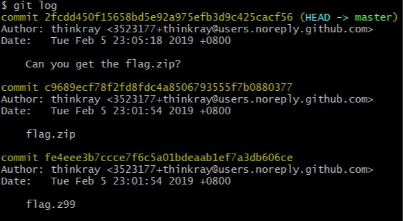
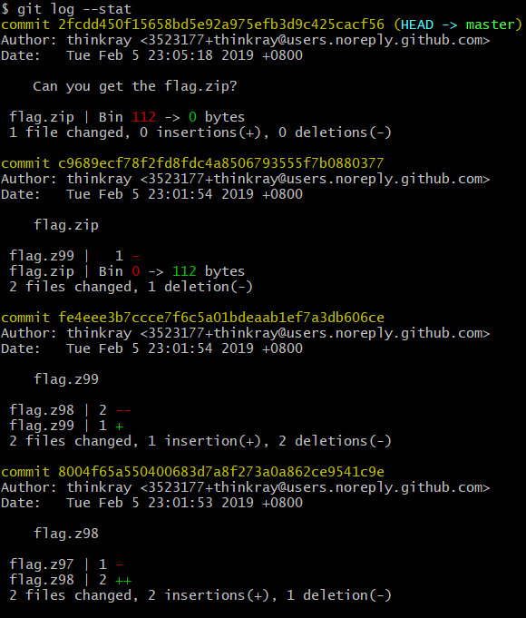
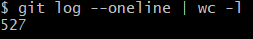
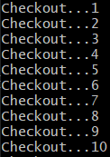
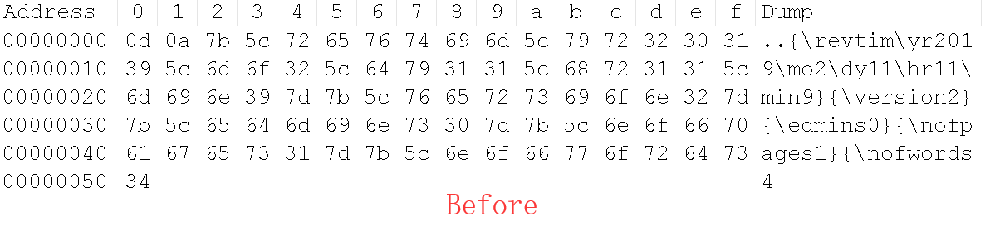
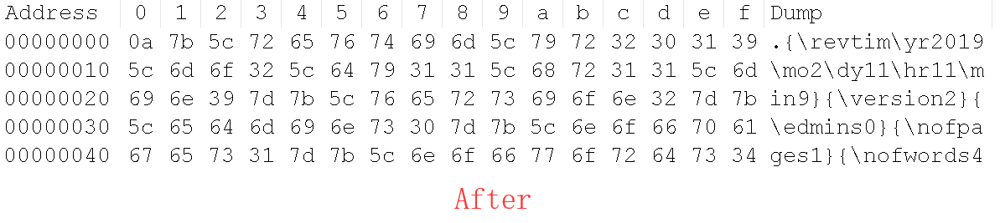

# Cat_Git.md writeup

这道题原本只是想简单考考脚本的编写，没想到出现了些意外状况。我看到有人做出这道题了，不过没有来找我要红包。欢迎给我发邮件 Kevin (at) binkic.com。

先说一下怎么解这一题吧。

这一题没绕什么弯，上来就是一个Git仓库。

先 ```git log ``` 一下



那么就 ```git log --stat``` 看看都commit了些什么吧。



那么有多少条commit呢？

```git log --oneline | wc -l```



527条。。。肯定不能手工checkout了（我的手还要留给osu!呢（不对

于是乎写个脚本:

```
#!/bin/bash

for((i=1;i<=525;i++));
do
	echo Checkout...$i;
	git checkout master~$i "*.*";
done
```

跑一下



zip分卷压缩包就出来了。

本来解压完之后，这题就结束了。不过。。。


这个rtf算是坏了，只能打开文本编辑器搜索flag，最后得到 **flag{$cript_1s_y0ur_fr1end}**

至于为什么rtf坏了，这不是我干的。。。一番diff之后一起看看Git干的好事吧（由于我没有保留原始文件，下面的例子是后面补的）





嗯。。。游戏体验极差