# History.zip writeup

这道题经过各种提示之后总算有人拿下了。涉及文件格式和隐写。

下面开始剥洋葱。

拿到zip之后，发现解压需要密码，那就打开看看。

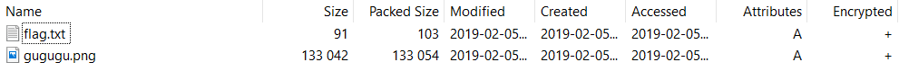

在注释里可以找到一个提示:

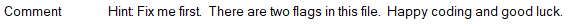

用个文本编辑器打开，发现在文件末尾有个密码。

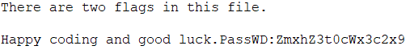

>**提示**
>
>#3 这个flag是解压密码经过某种变换后的结果
>
>   找规律：
>   
>   base64encode("flag{")="ZmxhZ3s="
>   
>   base64encode("flag{1")="ZmxhZ3sx"
>   
>   base64encode("flag{A")="ZmxhZ3tB"
>   
>   base64encode("flag{test")="ZmxhZ3t0ZXN0"

base63decode之后得到 **flag{tqlwsl}**

输入密码，解压压缩包

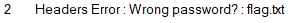

解出一张图片，flag.txt空空如也。

>“神仙PK之后，压缩包坏了一半”

看来是要修复zip压缩包了。

可以去看看 [关于zip格式的资料](https://ctf-wiki.github.io/ctf-wiki/misc/archive/zip/)

以16进制重新打开压缩包，发现是压缩包头部坏了。

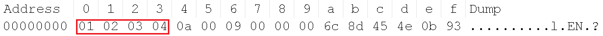

修复一下，改为 `50 4B 03 04`

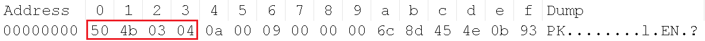

接下来就可以解压了。

flag并不在这里，提示去图片里找。

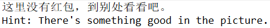

当成压缩文件打开看看:

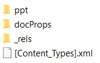

是个ppt，改成ppt打不开，换成pptx可以了。

提示需要修复:

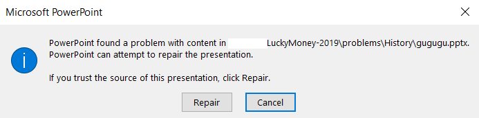
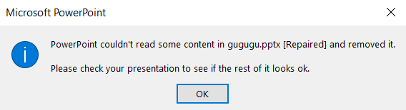

flag **曾经** 在这里:

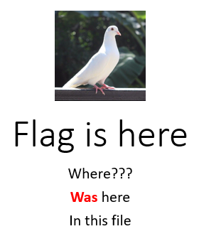

以及给后面题目的线索:

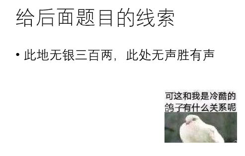

如果不慎点了保存的话，flag就再也找不到了。

flag其实就在这个鸽子图里

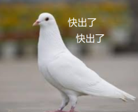

>图片变成了小矮人

可以去看看 [关于png格式的资料](https://ctf-wiki.github.io/ctf-wiki/misc/picture/png/)

把高度改大就可以看到结果了。

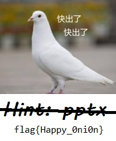

得到 **flag{Happy_0ni0n}**