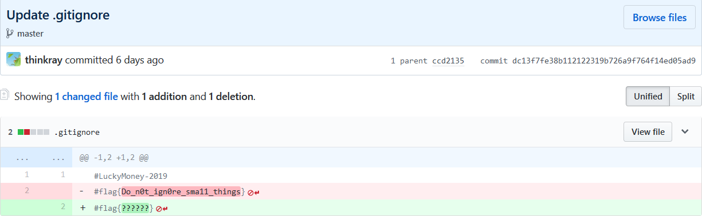

# Lucky Flag

>为了红包能送出去嘛。。。难度不会特别难。。。仔细看看一定能有点收获 (●—●)

担心红包派不出去，弄了两个几乎没有任何技术含量的彩蛋flag，没想到也只派出2个红包。。。

一个flag藏在 **readme.md** 的源文件里。

>这个flag可以在源文件里找到

得到 **flag{He1e_ls_a_flag}**

另一个flag藏在 **.gitignore** 的历史提交版本里。

>这个flag淹没在历史的长河里

找找历史版本:

得到 **flag{Do_n0t_ign0re_sma11_things}**
