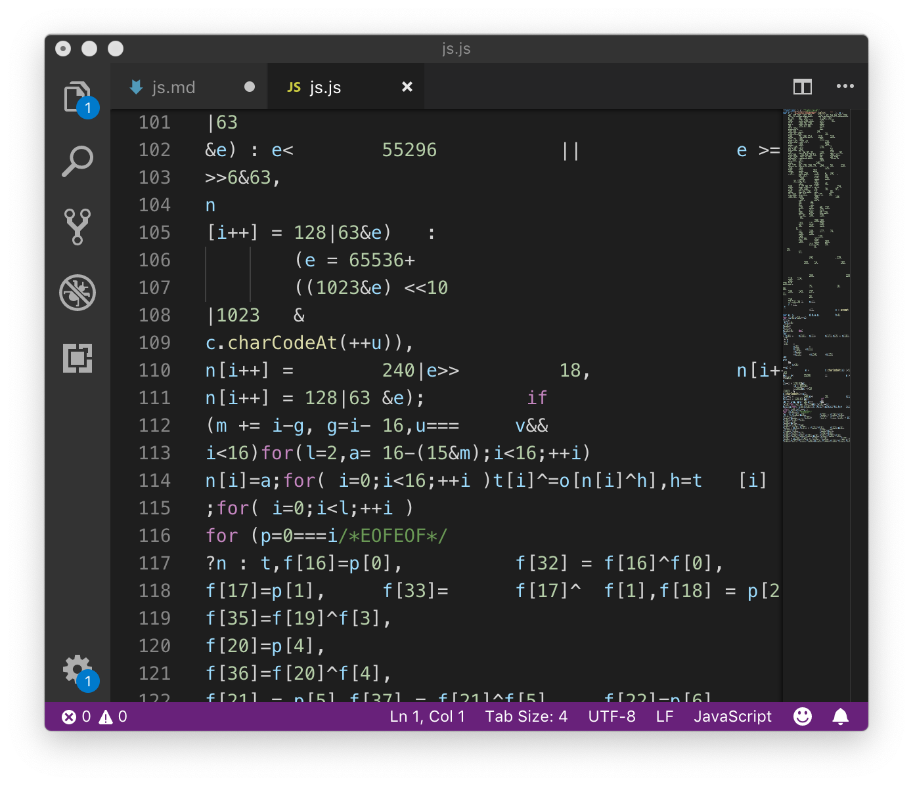
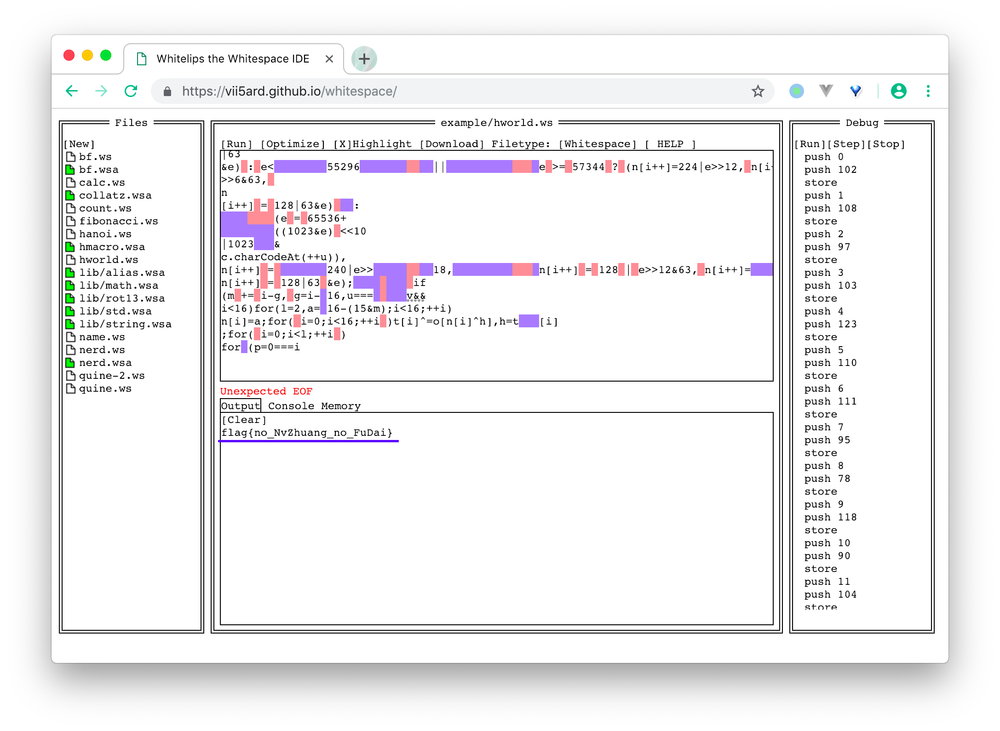
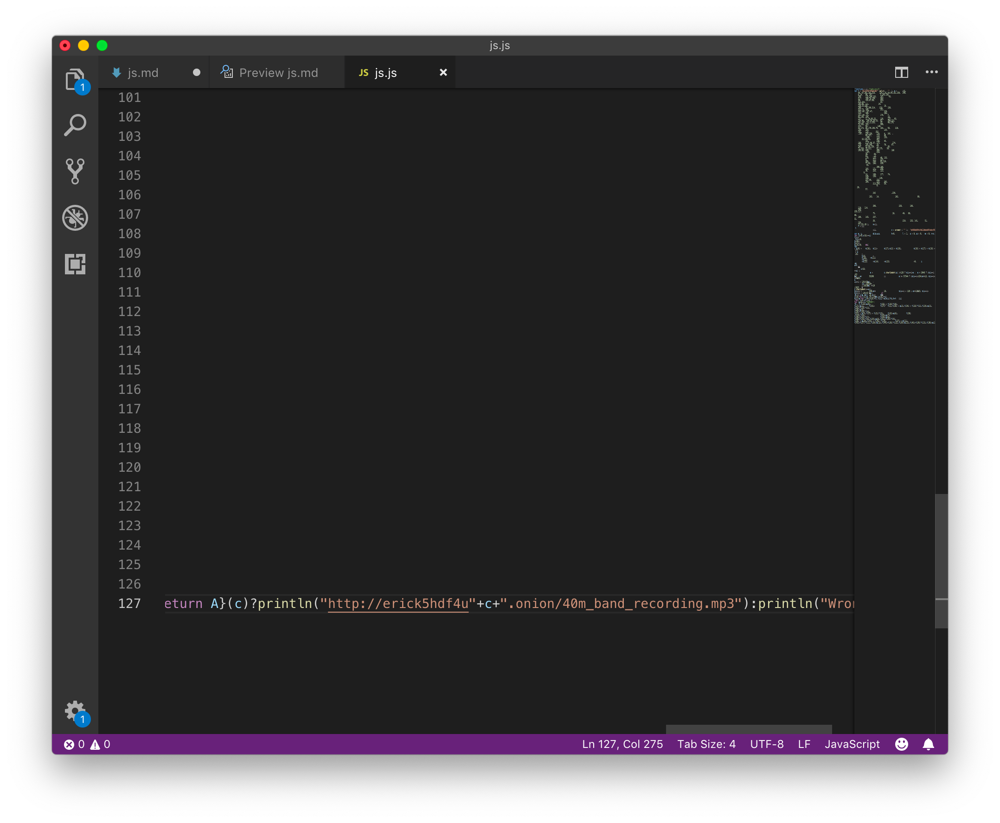
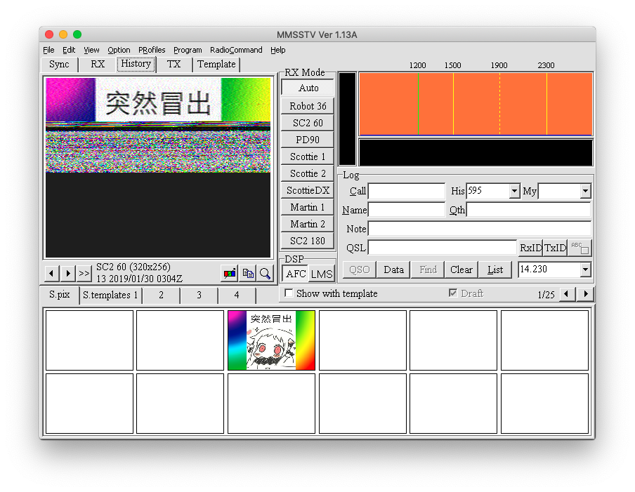
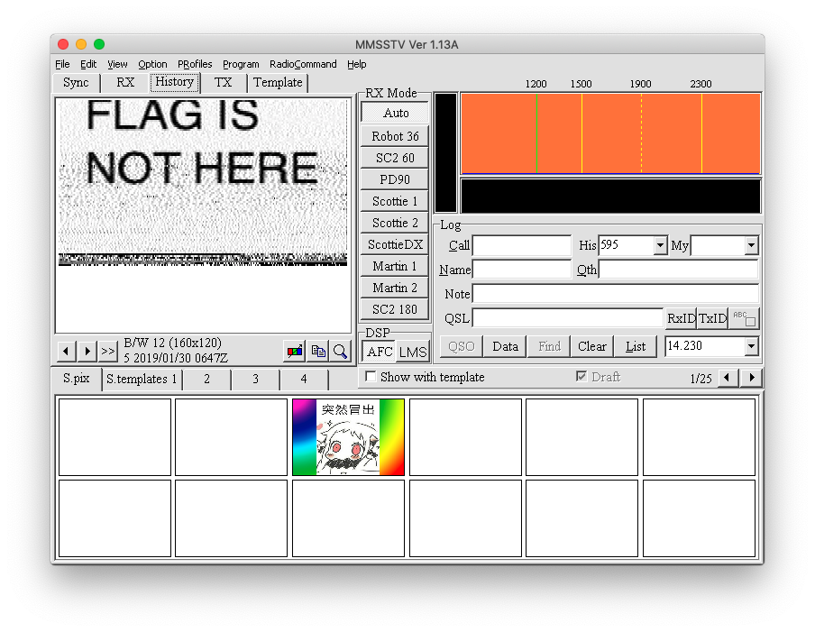
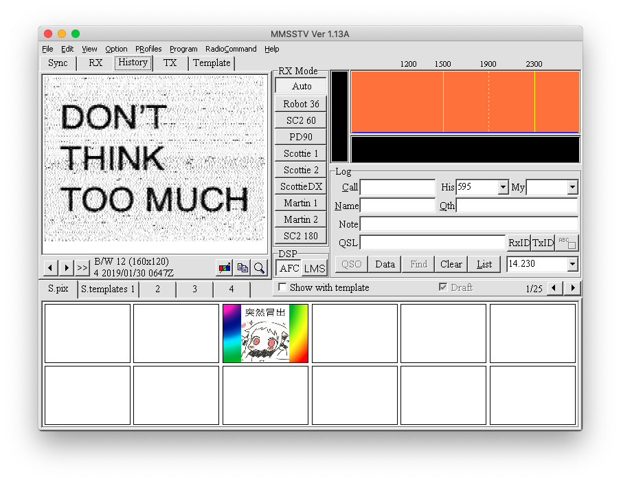
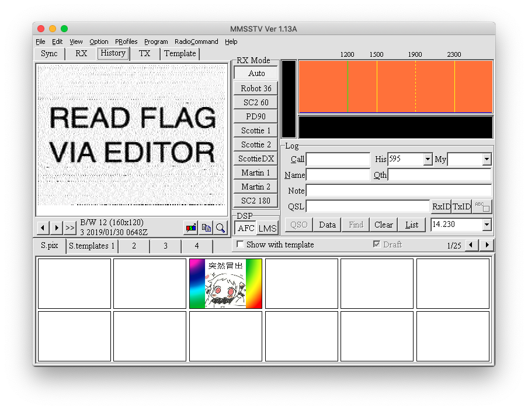
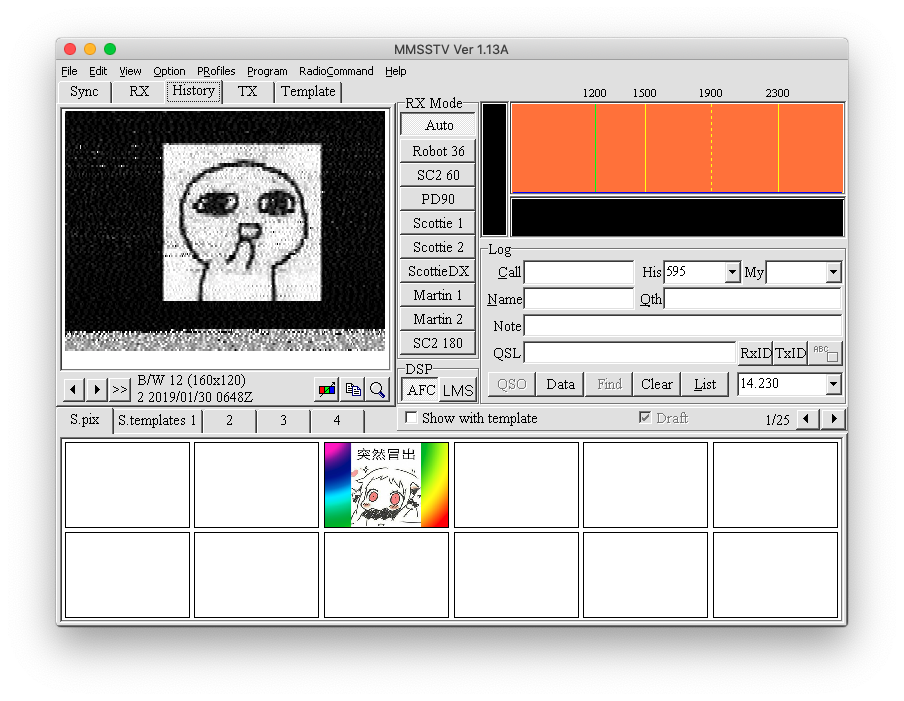

# js.js writeup

这道题被大佬嫌弃了2次。太沙雕了。还是得按照基本法来啊。

如果用编辑器打开就有可能发现排版是空格和tab混用，可以猜测是whitespace语言，但扔进解释器又跑不对，
也许你应该留心到有个EOF的注释（js是经过压缩的js，除了版权之类的本不应出现注释），

可以试一下把EOF及后面的内容删掉（其实不删掉也是能运行的），丢进[解释器](https://vii5ard.github.io/whitespace/)里，得到flag。你们搞的这个flag啊，excited！

不过到了这里，js里面究竟是个啥？js部分的核心是MD2散列算法，稍微搜索一下就知道：

最终正确输出将会是如图：

注意到有个println，故如果你用这个js直接跑穷举，别忘了加这个的实现。

根据onion域名的格式，可以得知被散列的文本长度为5，且为base32字符。那么就可以穷举了。

穷举用js可以采取多起点的方法，但是即使你根本没有优化，又找错了方向，得到原文也只要不到3分钟(i7-6700HQ)。最终得到原文是 `zrbf7`。

到了这里就可以从Tor下载到那个MP3了。如果你有足够的知识的话，就能发现MP3里面最明显的信号是SSTV（慢扫描电视）了。SSTV用于在类似电话线质量的信道上传输图像，一帧从8秒到几分钟不等。所以说还是得提高自己的知识水平。

Windows下有名为MMSSTV的软件可以用来收发SSTV。Linux/Mac下可以用Crossover（Wine未测试）运行。

最终捕捉到如下的画面：

这一帧不完整，掩盖了部分下一帧。完整的帧在下面。

检查MP3 ID3信息，什么都没有。可以确定确实在js文件里面藏着了。

MP3内还包含别的音频，揭秘一下：JJY（日本授时台）的一段信号，也就是能听到的有摩尔斯电码（其实就是JJY）的那个；以及意大利内一个40m波段电台的录音。